# BO 2 Test

## Normative Planung
- Leitbild und Unternehmensziele

### Strategische Planung
1. **Analysieren** der aktuellen Situation
2. Festlegung der strategischen Ziele
3. **Entwickeln** und **Bewerten** möglicher Strategien
4. Langfristig (Über **10 Jahre**)

### Operative Planung
1. Strategische Ziele in **Umsetzbare** Teilziele
2. Notwendigen Resourcen Planen
3. Durchführen

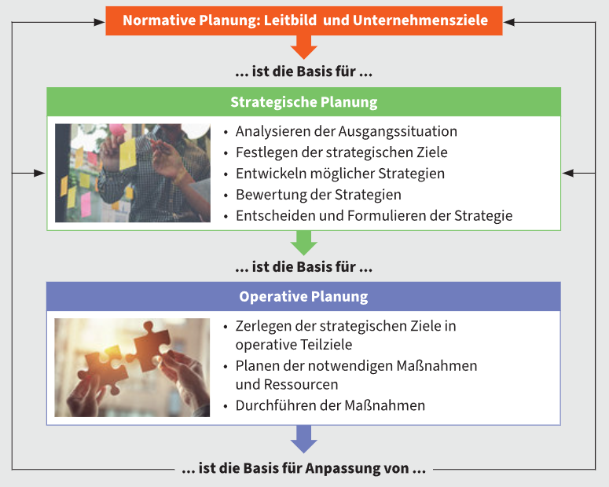

# Strategische Planung

## Zielsetzung

### SMART
- **Spezifisch**: Präzise Formulierte Ziele
- **Messbar**: Überprüfung der Zielerreichung möglich sein
- **Akzeptiert**: von Verantwortlichen akzeptiert
- **Realistisch**: Ziel muss erreichbar sein
- **Terminiert**: Muss innerhalb der Frist erledigt werden

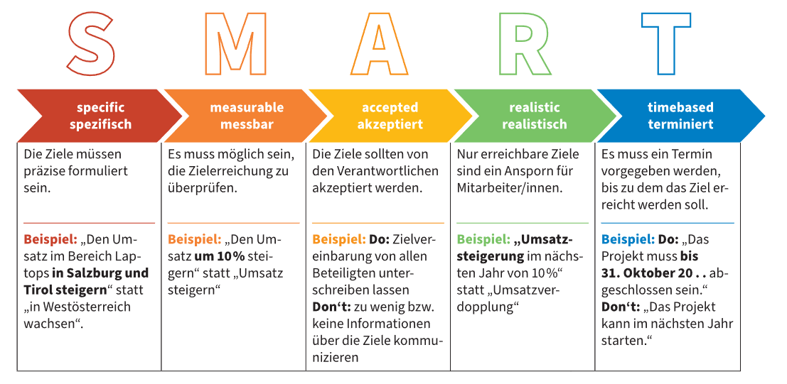

## Unternehmensziele
- ökonomisch
- ökologisch
- sozial

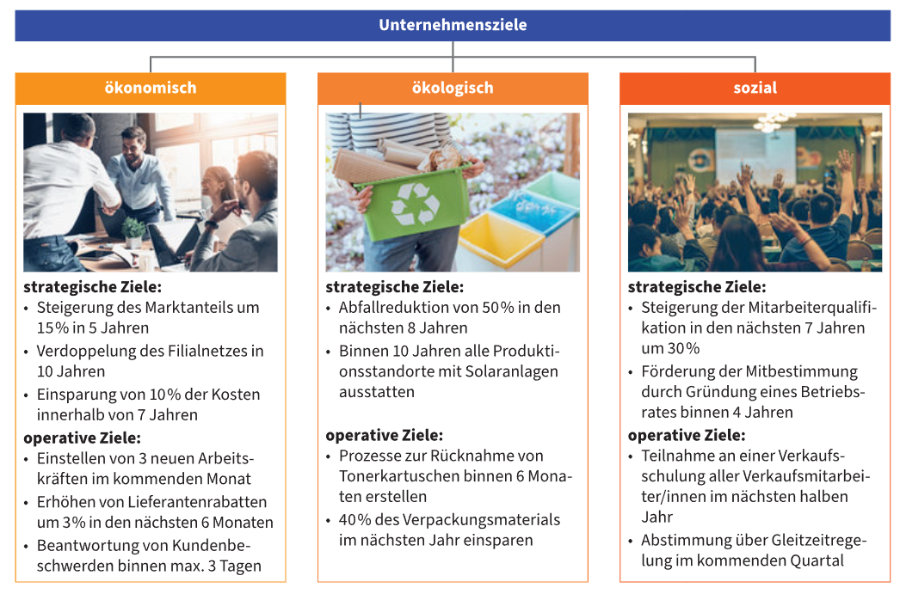

## Umfeldanalyse
- Äußeren Einflüsse die dein Unternehmen beeinflussen

### Umweltsphären
- Gesellschaft
- Natur
- Technologie
- Wirtschaft

### Stakeholder
- Staat
- Lieferanten
- Kapitalgeber
- ...

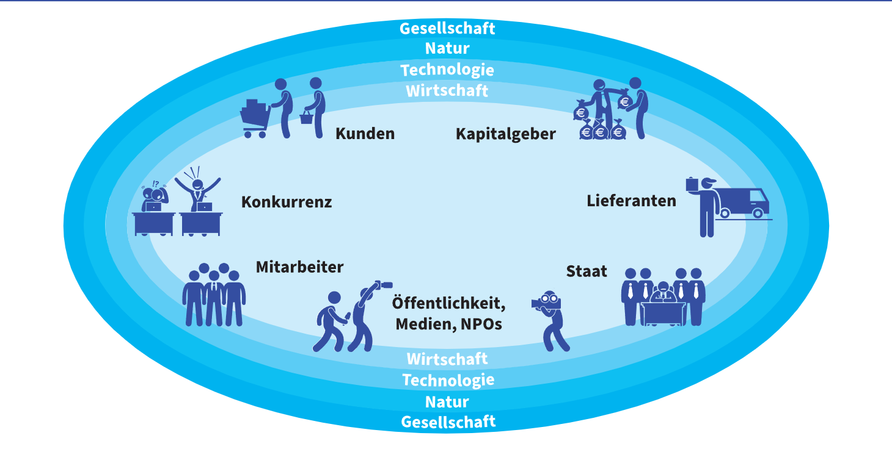

## Branchenanalyse
- Struktur und Dynamik der Branche
- im Detail mit **Kunden** und **Konkurrenz**

### 5 Kräfte Model
- Bestehende Konkurrenz
- Lieferanten
- Kunden
- Neue Anbieter
- Substitute

## Stärken - Schwäche Analyse
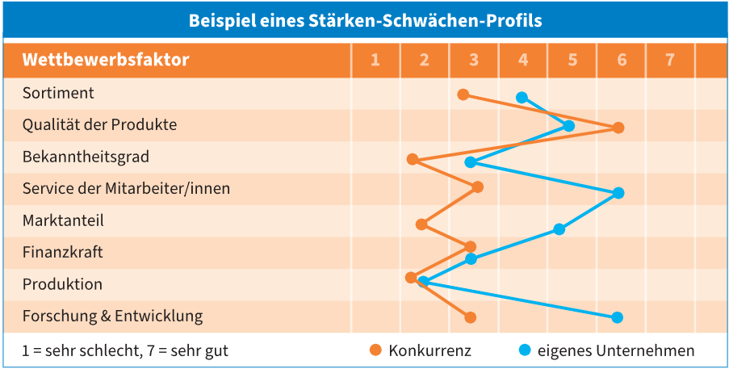

## SWOT-Analyse *(S.W.O.T)*

1. Stärken (Strength)
2. Schwächen (Weaknesses)
3. Chancen (Opportunities)
4. 

Risiken (Threats)
Thread.java

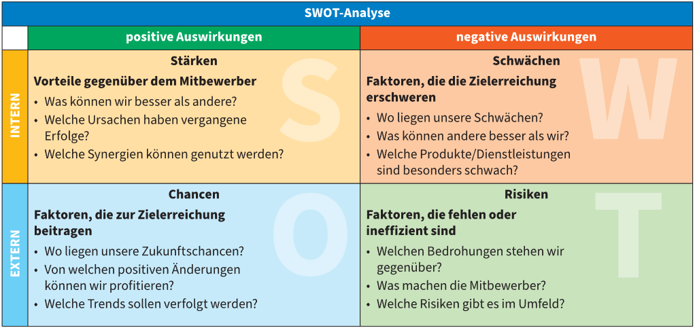

## Strategien
### S-O: *(Ausbauen)*
- Markt ausbauen
- neue Investitionen
- zusätliche Budgets

### S-T: *(Absichern)*
- Risiken minimiern
- Gefahren abwenden

### W-O: *(Aufholen)*
- Schwächen beseitigen
- Chancen nutzen

### W-T: *(Vermeiden)*
- Risiken vermeiden
- Gefahren begrenzen

## Portfolioanalyse
- Entscheidungen werden getroffen *via*:

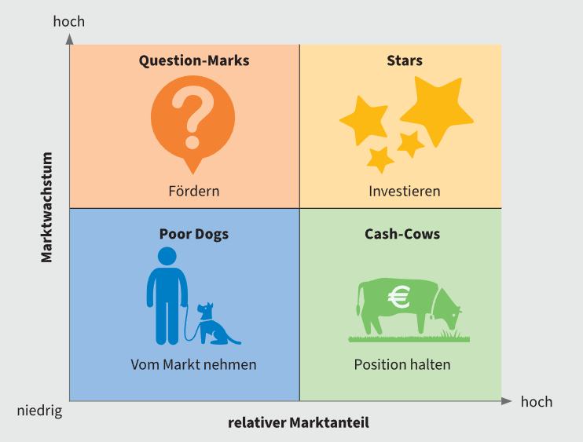

# Operative Planung

- Teilziele
- Strategische Ziele in konkrete Maßnahmen
- Notwendigen Resourcen Planen
- benötigte Budget
- kurzfristig (<= **1 Monat** - **1 Jahr**)

# Unternehmensorganisation

# Aufbauorganisation
- Aufgabe
- Stelle
  - Leitungsstelle *(Instanz)*
  - ausführende Stelle
  - Stabstelle
- Abteilung

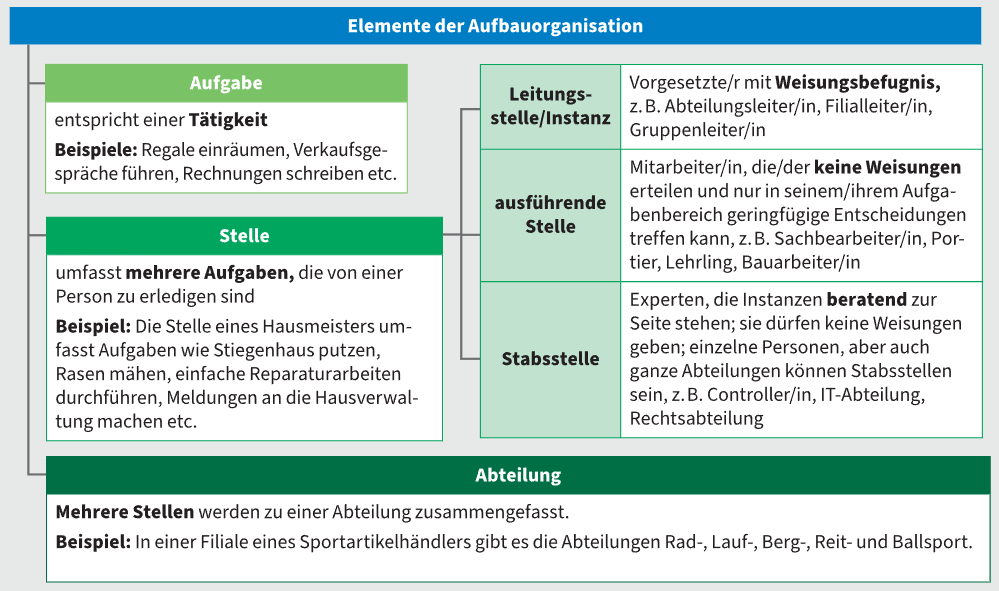

## Arten der Aufbauorganisation:
### Einliniensystem
- Jeder Mitarbeiter hat genau **einen** Vorgesetzten.
1. Gliederung nach **Funktionien**
2. Gliederung nach **Sparten**

### Mehrliniensystem
- Jeder Mitarbeiter kann **mehrere** Vorgesetzte haben.
1. Gliederung nach **Bereichen**, **Sparten** und **Funktionen** *(Matrixorganisationen)*.

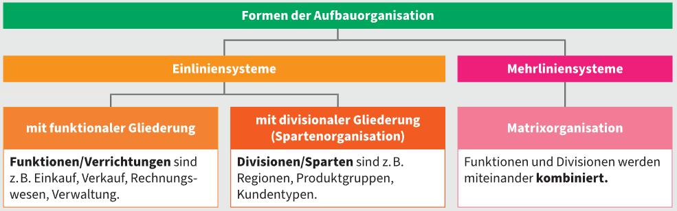

### Funktionale Gliederung
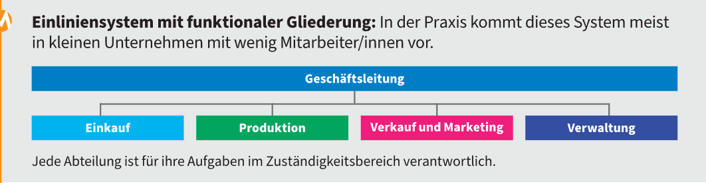

### Divisionale Gliederung
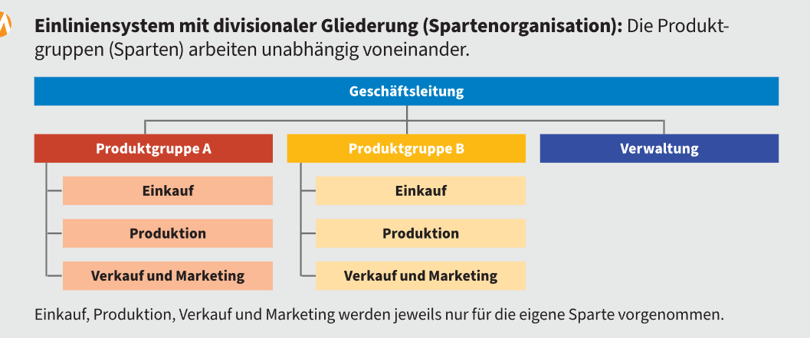

### Matrixorganisation
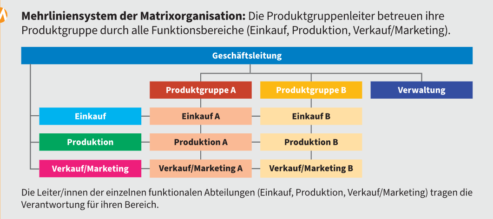

## Grundsätze
- Zweckmäßigkeit
- Wirtschaftlichkeit
- Transparenz
- Koordination
- humane Bedingungen

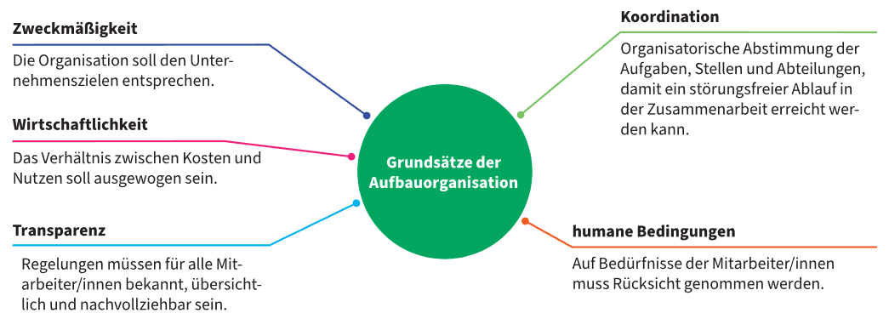

# Abblauforganisation
- Reihenfolge der Aufgaben
- Zusammengehörige Aufgaben **(Prozesse)**
- Welche Tätigkeiten **gleichzeitig** / **hintereinander**
- **Wo** und **Wann** werden Tätigkeiten ausgeführt

## Ziele und Aufgaben
- Einhalten der Termine
- Minimale Durchlaufzeiten
- Auslastung der vorhandenen Kapazitäten
- Erhöhen der Wertschöpfung

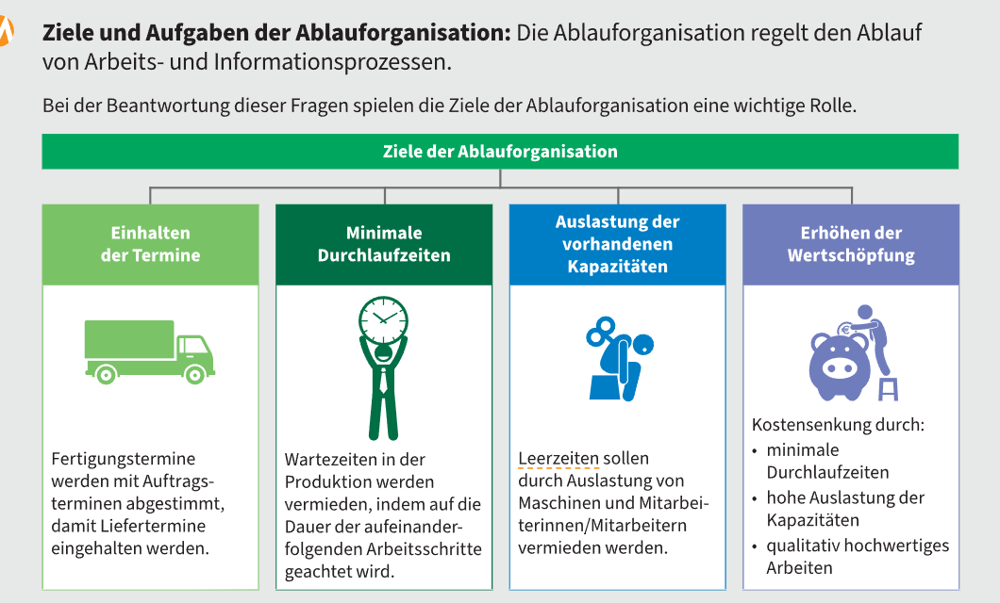

# Formelle und Informelle Oranisation

## Formelle Organisationen
- offiziell geplant
- offizielle strukturen
- offizielle Arbeitsteilung

## Informelle Organisationen
- inoffiziell.

### Arten der informellen Organisation
- informelle Führer
- informelle Normen
- informelle Kommunikation
- informelle Gruppen

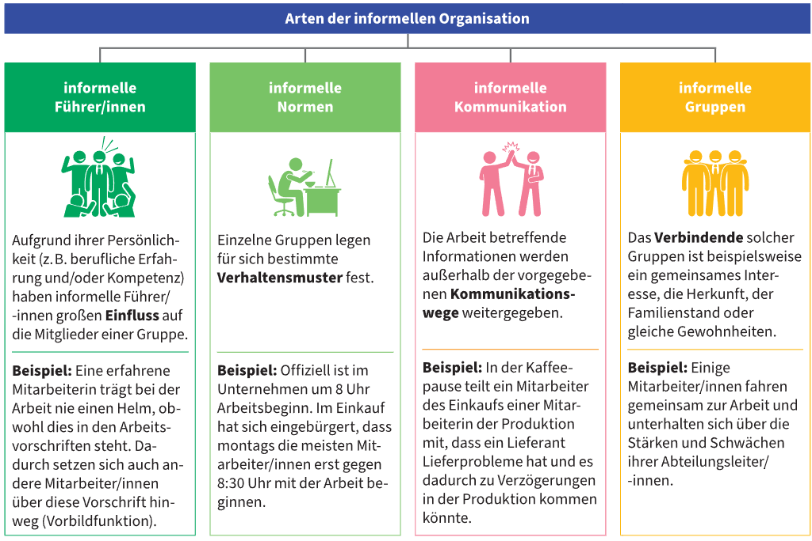

# Organisationskreislaufs

1. Auswahl des **Organisationsproblems**
    - Werden Ziele **nicht erreicht** oder gibt es **Schwachstellen**?
    - In welchen **Bereichen** werden **Untersuchungen** durchgeführt?
    - Welche **Ziele** müssen **erreicht werden** und wie werden sie **gemessen**?
    - Welche **Reorganisationsmaßnahmen** werden angestrebt?
      
2. **Aufnahme** des *Ist-Zustandes*
    - Informationsgewinn
      
3. **Anaylse** des *Ist-Zustandes*
    - Grundsatzkritik
    - Schwachstellenanalyse
    - Verfahrenskritik
      
4. **Entwicklung** einer *Soll-Konzeption*
    - Findung **alternativer Lösungsansätze**
      
5. **Einführung** der *Soll-Konzeption*
   - Einsatzungsvorbereitung
   - Übernahmephase *(Realisierung)*
     
6. **Kontrolle**
    - Nicht wieder in **alte Regelungen** verfallen
    - Treten **Prognostizierten Änderungen** ein?
      

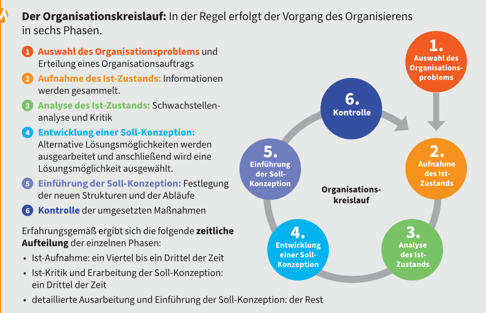

# 7 W-Fragen
- Wer?
- Wo?
- Wann?
- Womit? / Wie?
- Woran?
- Warum?

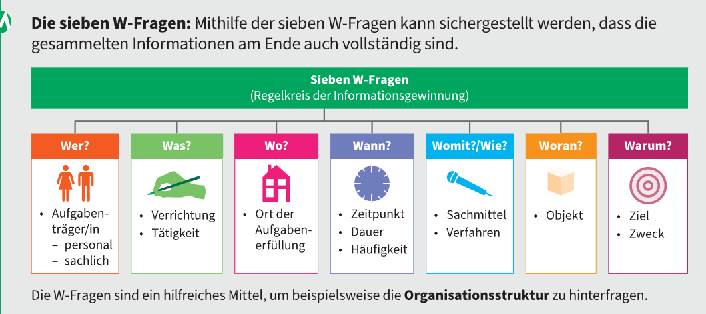

# Schwierigkeiten bei der Informationsgewinnung
- Bei **Umfragen** *(nicht objektive Techniken)* könnten **falsche Daten** angegeben werden

## Erhebungstechniken
- objektiv
- nicht objektiv
- In der **Praxis** wird oft **beides** verwendet.

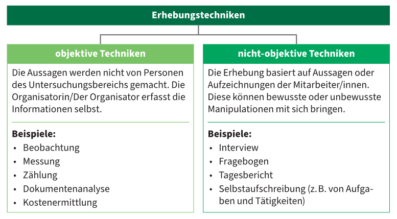

# Netzplan
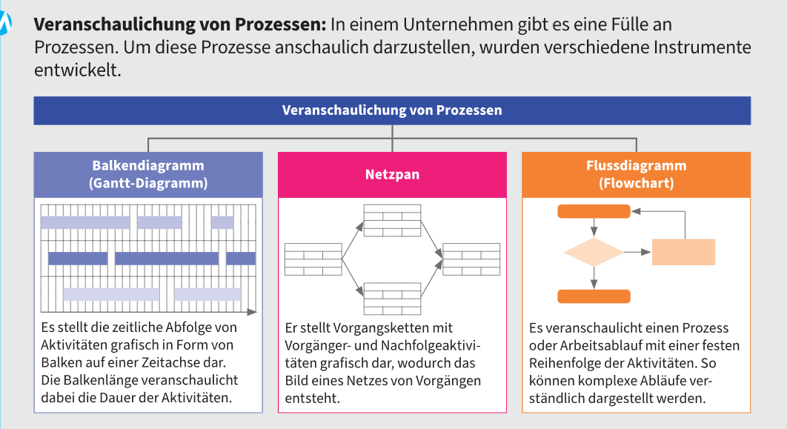

## Balkendiagramm
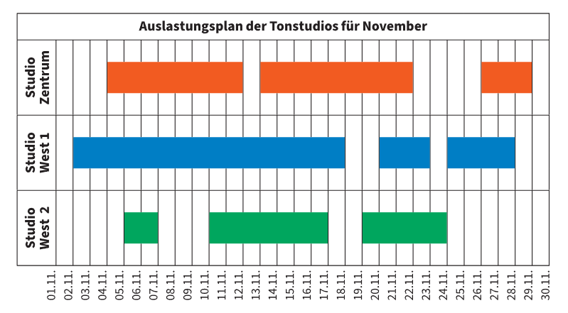

## Netzplan
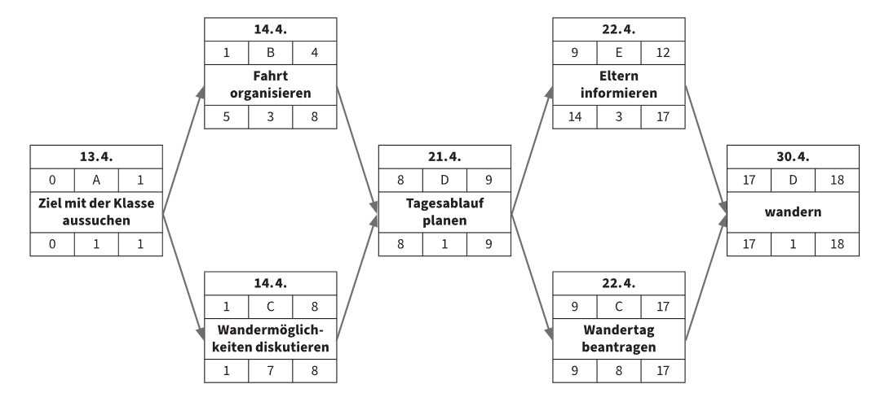

## Flussdiagramm
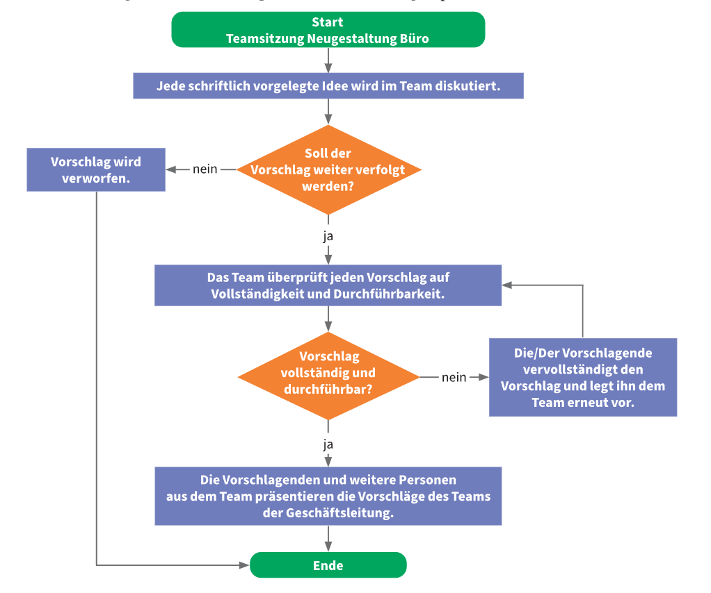

# Extra Info
### Keine Ahnung ob die scheiße kommt
## Prognose
- künftige Entwicklung von **Produkten, Branchen, Märkten** einzuschätzen
- Entscheidungen vorbereiten

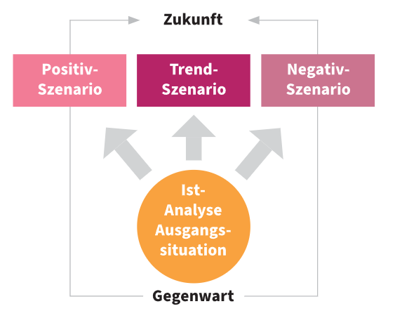

