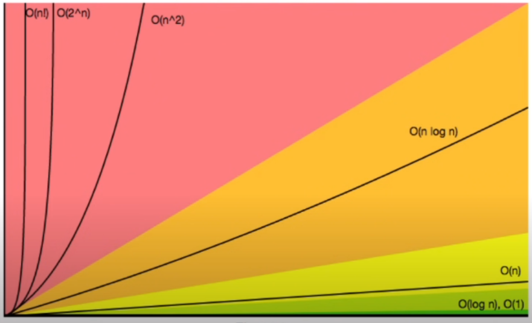
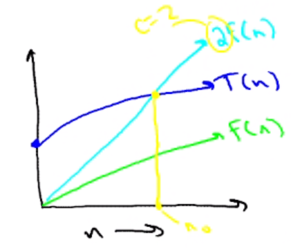

# Algorithms
- Schritte (Rezepte) für ein Ergebnis
- *Gute* und *Schlechte*

## Improve Code
- Algorithmen

## Time Complexity
- Anzahl der Operationen

### Cases:
- **Worst-case**:
  - Listenelemente in reverse (viele Operations)
- **Best-case**:
  - Listenelemente bereits sortiert (keine / fast keine Operationen)
- **Average-case**:
  - Listenelemente zufällig (mittelmäßig viele Operationen)

## Calculating time complexity


- Line 6: 1 Operation
- Line 7: 1 Operation
- Line 9-13: n Operationen (wegen Loop)
- Line 10: 1 Operation
- Line 11: Das ist der Bereich in der If-Abfrage. 
Wenn wir vom Worst case ausgehen, das es genau in der gegengesetzten reinfolge läuft, 
dann werden das array.length Operationen
- Line 14: 1 Operation

## Asymptotic analysis
- Formel: **k(n) + c**
  - **k**: Anzahl der Operationen **innerhalb** der Schleife
  - **n**: Anzahl der Schleifen **durchgänge**
  - **c**: Anzahl der Operationen **außerhalb** der Schleife
<br><br>
- In unserem Fall: **2(n) + 3**
  - 2 Operationen innerhalb der Schleife
  - n... Wissen wir nicht, kommt auf die Liste drauf an
  - 3 Operationen außerhalb der Schleife
    <br><br>
- Bei **n** durchgängen erhalten wir dann den Wert:


## Prinzipien
1. Immer vom **Worst-Case** ausgehen
    - Weil: Best- und Average-Case sind abgedeckt
2. **Constant factors** und **Lower terms** werden ausgelassen
    - Weil: Einfacher
3. Man sollte nur große **Inputgrößen** (viele operationen) beachten
    - Nur große Probleme sind ineressant

## Big-O Notation
- Damit berechnet man sich die Durchlaufszeiten der Algorithmen
- https://www.youtube.com/watch?v=__vX2sjlpXU

### Ungefähre Durchlaufszeiten:



### Konkrete Beispiele:
- Hier wird gezeigt, wo man jene Big O Notation einsetzt


## Big Theta / Big Omega
- Big Theta: upperbound
- Big Omega: lowerbound



- T(n) = O(f(n))
- T(n) ... random Funktion
- O(f(n)) ... Big Oh dieser Funktion

### Upperbound (Theta) berechnen:
- Funktion <= funktion (wo alle Parts das Big Oh angehängt bekommen, oder entfernt wird fals vorhanden)
- Beispiel

```
T(n) = n³ + 3 + 4n²
T(n) = O(n³)

Theta: n³ + 3 + 4n² <= n³ + 3n³ + 4n³ <= 8n³
... Alle summanden bekommen das Big Oh angehängt (n³), 
schon vorhandene n werden entfernt. 
```

### Lowerbound (Omega) berechnen:
- Funktion >= highest term der Funktion
- Beispiel

```
T(n) = n³ + 3 + 4n²
T(n) = O(n³)

Omega: n³ + 3 + 4n² >= n³
... Droppen aller lower terms (3, 4n²), dass heißt es bleibt n³ übrig.
```

Aus den Beiden folgt:
- n³ <= n³ + 3 + 4n² <= 8n³

<hr>

Beispiel 1:
```
6n log(n) + 7n +5  = O(n log(n))
6n log(n) + 7n + 5 >= 6n log(n) fuer alle n > 0
6n log(n) + 7n + 5 <= 6n log(n) + 7n log(N) + 5n log(n)
6n log(n) + 7n + 5 <=  18n log(n)
```
Beispiel 2:
```
5 + 1/n = O(1)
5 + 1/n <= 6
5 + 1/n >= 5
```
Beispiel 3:
```
4n + 3 + n^3 + 25n^6 = O(n^6)
4n +3 + n^3 + 25n^6 <= 4n^6 + 3n^6 + n^6 + 25n^6 <= 33n^6
4n + 3 + n^3 + 25n^6 >= 25n^6
```

Links die halfen es zu verstehen:
- https://www.youtube.com/watch?v=Vzqaz4MDGvc
- https://www.youtube.com/watch?v=0oDAlMwTrLo
