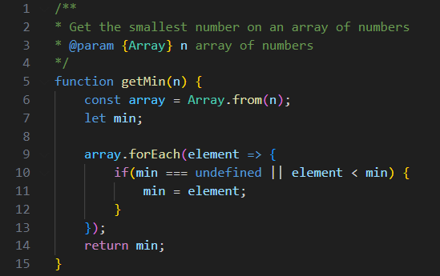
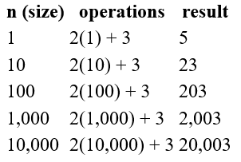
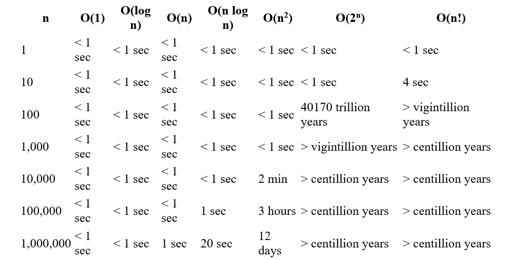
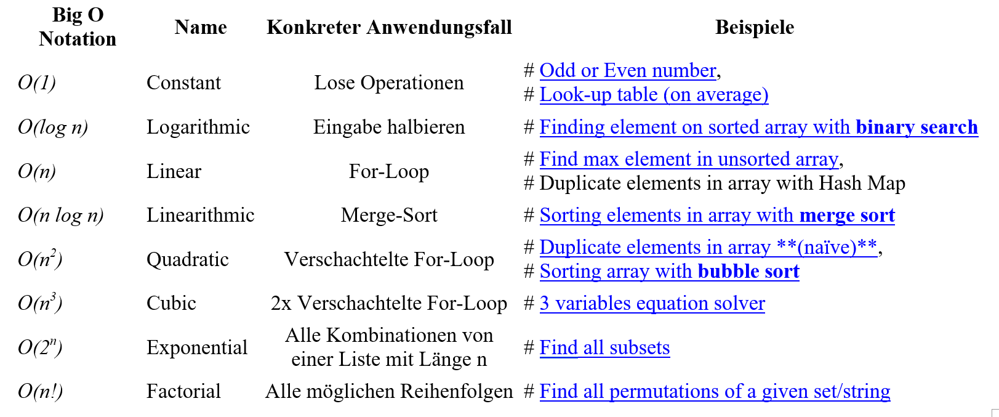

# Algorithms
- Schritte (Rezepte) für ein Ergebnis
- *Gute* und *Schlechte*

# Improve Code
- Algorithmen

## Time Complexity
- Anzahl der Operationen

### Cases:
- **Worst-case**:
  - Listenelemente in reverse (viele Operations)
- **Best-case**:
  - Listenelemente bereits sortiert (keine / fast keine Operationen)
- **Average-case**:
  - Listenelemente zufällig (mittelmäßig viele Operationen)

## Calculating time complexity

- Line 6: 1 Operation
- Line 7: 1 Operation
- Line 9-13: n Operationen (wegen Loop)
- Line 10: 1 Operation
- Line 11: Das ist der Bereich in der If-Abfrage. 
Wenn wir vom Worst case ausgehen, das es genau in der gegengesetzten reinfolge läuft, 
dann werden das array.length Operationen
- Line 14: 1 Operation

## Asymptotic analysis
- Formel: **k(n) + c**
  - **k**: Anzahl der Operationen **innerhalb** der Schleife
  - **n**: Anzahl der Schleifen **durchgänge**
  - **c**: Anzahl der Operationen **außerhalb** der Schleife
  
- In unserem Fall: **2(n) + 3**
  - 2 Operationen innerhalb der Schleife
  - n... Wissen wir nicht, kommt auf die Liste drauf an
  - 3 Operationen außerhalb der Schleife
      
- Bei **n** durchgängen erhalten wir dann den Wert:

## Big-O Notation
- Damit berechnet man sich die Durchlaufszeiten der Algorithmen

### Ungefähre Durchlaufszeiten:

### Konkrete Beispiele:
- Hier wird gezeigt, wo man jene Big O Notation einsetzt

