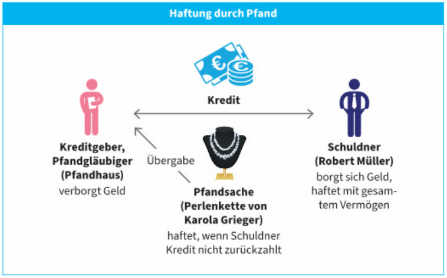
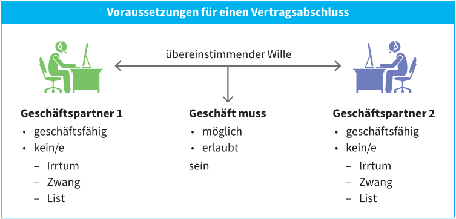

# Recht

### Objektives Recht
- Rechtsordnungen, die für **alle** gelten
- z.B: Konsumentenschutzgesetzt

### Subjektives Recht
- Rechtsordnungen, die nur für **bestimmte Personengruppen** gelten
- z.B: Wahre, die nach paar Wochen nicht mehr funktioniert, **Recht auf Gewährleistung**

## Privatrecht
- Rechtsverhätnissen zwischen **privaten** Personen
- z.B: Kaufvertrag, Familienrecht, Arbeitsverträge, ...

### Allgemeines Privatrecht
- Regelungen, die für **jeden** zutreffen
### Sonderprivatrecht
- Regelungen, nur für **bestimmte Gruppen**
- z.B: Ehegesetzt, Konsumentenschutzgesetzt

## Öffentliches Recht
- Regelungen zwischen Bürgern und Staat
- z.B: Strafrecht, Verwaltungsrecht, ...

### ABGB
- Allgemeiner Teil
- Sachenrecht
- Schuldrecht
- Erbrecht

  

## Personenrecht
### Rechtsfähigkeit
#### Natürliche Peronen:
- **Definition:** alle Menschen
- **Beginn:** ab Geburt (Rechte für Ungeborene [Schadenersatz, Erbrecht])
- **Ende:** durch Tod

#### Juristische Personen: 
- **Definition:** künstliche Gebilde, denen der Gesegtzgeber Rechtssubjektivität zugesteht (GmbH, Bund, Länder)
- **Beginn:** mit der Gründung
- **Ende:** durch die Auflösung

#### Rechtssubjekte:
- sind Natürliche und Juristische Personen
- haben Rechte und Pflichten
- treten durch Rechtsgeschäfte in Verbindung

#### Rechtsobjekte:
- Sachen die zum Gebrauch dienen
- keine Rechte und Pflichten

### Tod einer natürlichen Person
| Beweis Todes                               |
|--------------------------------------------|
| Austellung Todesschein                     |
| Gerichtsbeschluss                          |
| gerichtliches Verfahren zur Todeserklärung |

### Verschollenheit
| Art der Verschollenheit            | Fristen                                                    | 
|------------------------------------|------------------------------------------------------------|
| Allgemeine Verschollenheit         | mind. 10 Jahre nach letzter Nachricht (80-jährige 5 Jahre) |
| Allgemeine Gefahrenverschollenhiet | 1 Jahr ab Wegfall der Gefahr (zB Erdbeben)                 |
| Kreigsverschollenheit              | 1 Jahr nach Kriegsende                                     |
| Seeverschollenheit                 | mindestens 6 Monate (zB nach untergang eines Schiffes)     |
| Luftverschollenheit                | mindestens 3 Monate (zB nach Abstürz eines Flugzeuges)     |

### Handlungsfähigkeit
#### Deliktsfähigkeit
- Ab **14 Jahren**
- **Zivilrechtliche Deliktsfähigkeit**: 
  - Man muss für den **Schaden** den man verursacht aufkommen.
  - Man kann auch **unter 14 Jahren deliktsfähig** sein, wenn man trotz des Alters Einsichtig ist.
#### Geschäftsfähigkeit
| Alter   | Bezeichnung                 | Geschäftsfähigkeit                                                                                                                                                          |
|---------|-----------------------------|-----------------------------------------------------------------------------------------------------------------------------------------------------------------------------|
| 1 - 7   | Kinder                      | **nicht Geschäftsfähig**:  Geringfügige Sachen aber erlaubt                                                                                                             |
| 7 - 14  | unmündige Minderjährige | **beschränkt Geschäftsfähig**:  "Günstige" Sachen kaufen z.B: Kinokarten, ... Sie dürfen Geschenke annehmen, die mit keinen weiteren Verpflichtungen verbunden sind |
| 14 - 18 | mündige Minderjährige   | **erweitert Geschäftsfähig**:  Dürfen mit ihren einkommen alles kaufen was sie sich leisten können.                                                                     |
| 18+     | Volljährige                 | **voll Geschäftsfähig**: Dürfen alles kaufen                                                                                                                            |

##### Beispiele:
- Unter 16 Jahren keine Tattoos
- Mit 18 Jahren darf alles gekauft werden
  

### Handlungsfähigkeit juritischer Personen
- Handeln nur durch ihre **Organe**
  - *Organe* sind **natürliche Personen**
- haften für **Vereinsvermögen**

 

## Gesetztliche Vertretung
## Minderjährige
- Eltern (wenn Eltern verheiratet)
- Mutter (wenn Eltern nicht verheiratet)
- Großeltern, Pflegeeltern
- sonstige Personen
- Jugendwohlfahrt

### Regeln
- Hat das Kind ein eigenes Vermögen (z.B: Erbschaft), ist die Vorsorgemacht dazu verpflichtet, dass das Vermögen gleich viel Wert bleibt, bis es Volljährig ist.
- Geld muss ***mündelsicher*** angelegt werden, z.B: Sparbücher, Staatsanleihen, ...
- Ab 14 Jahren darf das Kind teilweise selbst bei Scheidungsverfahren mitreden

## Volljährige
- Erwachsenenvertreter für psychischer Krankheiten oder Beinträchtigungen

### Regeln
- Brauchen eine Vertretung, wenn sie durch psychische Krankheiten beeinträchtigt sind.
- So lange wie möglich selbstbestimmen können

#### Vorsorgemacht:
- Man bestimmt eine Vertraunsperson **bevor** man die Entscheidungsfähigkeit verliert.
- Notar

#### Gewählte Erwachsenenvertretung
- Falls keine Vorsorgemacht errichtet werden kann
- Vertreter wird gewählt
- Notar, Rechtsanwalt oder Erwachsenenschutzverrein

#### Gesetztliche Erwachsenenvertretung
- Wenn weder Vorsorgemacht noch gewählte Erwachsenenvertretung möglich ist.
  - z.B: Demenz
- Vertretungsbefugnis nächster Angehöriger (Ehepartner, Eltern, Kinder, ...)

#### Gerichtliche Erwachsenenvertretung
- Wenn Oberes nicht möglich ist
- Wird vom **Gericht** gewählt

### Krankenanstalten
Personen können in eine **psychische Anstallt** untergebracht werden, wenn eines der folgenden Zustimmt:
- Die Person ist psychisch Krank (sind wir alle)
- Es besteht akute Selbst- oder Fremdgefährdung

### Vertretung durch Kurator
- **Ungebohrene**: z.B: Wahrung des Erbrechts
- **Abwesende**: z.B: Vermisste Personen *Miete* bezahlen.

 

## Der Kauf
### Vertragsabschluss
- Einigung des Vertrages
### Vertragserfüllung
- Erfüllung des Vertrages

### Gesetzte
- **Privatperson** zu **Privatperson**: *ABGB*
- **Privatperson** zu **Unternehmen**: *ABGB* + *UGB* + *KSchG*
- **Unternehmen** zu **Unternehmen**: *ABGB* + *UGB*

 

## Sachenrecht
- Eigentum
- Pfand
- Dienstbarkeit
- Reallast
- Baurecht

### Eigentumserwerb
- **abgeleitet**: Eigentum von *Vorgänger übernommen*. Neue Eigentümer hat die selben Rechte wie der vorbesitzer.
- **ursprünglich**: Eigentum hatte *keinen Vorgönger*. Rechte entstehen aus dem Gesetzt.

| Berechtigung                                                  | Rechtsgrund                                          | Übergabe                                                                 |
|---------------------------------------------------------------|------------------------------------------------------|--------------------------------------------------------------------------|
| Person muss *verfügungsberechtigter Eigentümer* sein. | z.B: - Schenkung - Kauf - Gerichtsurteil | Übergabe an den Erwerber mit dem Willen, Eigentum zu übertragen. |

#### Beispiele
- Am 12. Mai schließt ein Unternehmen einen Kaufvertrag über Maschinenteile ab. Am 20. Mai holt der Käufer die Teile ab und erlangt damit das Eigentum, da die Teile physisch übergeben wurden. Die Zahlung am 25. Mai ist nicht Voraussetzung für den Eigentumserwerb.
- Martha Müllner bringt Kleidung in einen Secondhandshop, der diese für sie verkauft und dafür einen Teil des Kaufpreises behält. Falls die Kleidung nicht verkauft wird, bekommt sie sie zurück. Der Inhaber ist nicht Eigentümer der Kleidung, sondern darf sie nur verkaufen. Zwei Tage später kauft Renate Sommer die Kleidung und erwirbt so das Eigentum. Wenn eine körperliche Übergabe nicht möglich ist, kann eine **symbolische Übergabe** erfolgen, z. B. durch Frachtpapiere.

### Pfand
- Beim Geldausborgen sicher sein, das Geld **zurück zu bekommen**.
- Falls Kreditnähmer nicht zahlt, kann man die Sache zu *Erlös* machen, was dann die Schuld bezahlt.
  - **Erlös**: Öffetnliche Versteigerung
- Erfolgt über ***Mittelmann***

#### Beispiele
- Robert Müller nimmt bei einem Pfandhaus ein Darlehen auf, gesichert durch die Verpfändung einer Perlenkette von Karola Grieger. Die Kette muss dem Pfandhaus tatsächlich übergeben werden, sonst gibt es kein Pfandrecht. Falls Robert Müller das Darlehen nicht zurückzahlt, haftet er mit seinem gesamten Vermögen, auf das das Pfandhaus zugreifen kann, um die Schuld zu decken.

 

## Grundbuch
- Öffentliches Verzeichnis alles **Grundstücke** 
- Besteht aus **Hauptbuch** und **Urkundensammlung**

### Wichtige Prinzipien
- **Eintragung**: Rechte an Grundstücken
- **Antragung**: Eintragen im Grundbuch
- **Vertrauen**: Auf Richtigkeit vertrauen können
- **Öffentlichkeit**: Es ist alles für alle Verfügbar
- **Prioritätsprinzip**: Früherer Eintrag hat höhere Priorität

 

## Hypothek
- **Pfandrecht** an einem **Grundstück**
- Es muss einen **Rechtsgrund** geben und im **Grundbuch** vorhanden sein.
- Beim Pfänden gilt das **Prioritätsprinzip**

### Beispiel (Prioritätsprinzip)
1: Pfandrecht 35k 
2: Pfandrecht 50k

*Es werden 50k erlangt bei einer Versteigerung*

1 bekommt volle 35k  
2 bekommt nur 15k (die von den 50k übrig bleiben)

## Dienstbarkeit
- Beschränkte dingliche Nutzungsrechte
- Eigentümer ist dazu verpflichtet, von einer anderen Person etwas zu dulden.

### Beispiel
Zum Beispiel **Wegerecht**. Hierbei erhält eine Person (z. B. ein Nachbar) das Recht, einen bestimmten Weg über das Grundstück eines anderen zu nutzen, um beispielsweise leichter zu ihrem eigenen Grundstück zu gelangen.

 

## Vertragsabschluss

 

## Kaufvertrag
### Inhalt
- **Welche Ware** wird verkauft?
- **Welcher Preis** ist zu zahlen?
- **Zwischen wem** findet der Vertrag statt

 

## Fern- und Auswärtsgeschäftegesetz
### Bedingung
- vertrag zwischen Unternehmer und Verbraucher
- - entweder abgeschlossen **außerhalb vom geschäft** vom unternehmer z.b. Badewanne Installiere lassen
- - oder wenn beide teilnehmer **nicht körperlich anwesend** sind z.b. onlineshop oder telefonisch
#### Tritt nicht ein wenn:
- kosten nicht über 50€
- vor einem Notar
- Verkaufsautomaten
- Immobilien
- ...

 

## Ruecktrittsrecht
- (steht im FAGG)
- SANDY: "1 Beispiel nennen"
### Bedingungen
- ohne Günde angeben zu müssen
- ohne Einhaltung bestimmter Form
- innerhalb von 14 Tagen
#### Dienstleistungsvertraege
- Frist ab Vertragsabschluss
#### Kaufvertraege
- Frist ab übergabe der Ware
#### Wenn Kunde nicht informiert!
- Frist sobald er davon erfaehrt
- Bis spaetestens 1 Jahr nach Vertragsabschluss beginnt die frist
also 1 Jahr und 14 tage nach abschluss Endet frist 
### Effekt
- Unternehmer muss sofort alle Zahlungen und Lieferkosten zurueckerstatten
- dabei muss selbes zahlungsmittel wie vom kunden verwendet werden
- (Mit gutscheinen zurueckzahlen nicht erlaubt, ausser kunde hat es so gemacht)
- Versand wird nicht rueckerstattet wird wenn dem Kunden das gesagt wird
### Kein Recht wenn:
- **Dienstleistung** und wird vor ablauf der frist durchgefuehrt
- - kunde muss ausdruecklich verlangt haben (dass es sofort gemacht wird)
- - kunde muss bestaetigen dass er anspruch auf Rücktrittsrecht verliert
- **Waren die nach Kundenvorgabe** angefertigt wurden
- **Untrennbare Waren** z.b. Heizöl das in den Tank geleert wird
 

## Schadenersatz
- Nicht immer gibt es *Schadenersatz*
- z.B: Bei Knochenbruch gibt es keinen Schadenersatz
  - Für solche Fälle gibt es **Versicherungen**
- Grundsatz: ***"Jeder hat seinen Schaden selber zu bezahlen."***
- Ein Sachverhalt kann auch eine **gerichtliche Strafe** mit sich ziehen.

### Gründe
- **Ausgleich** für erlittene Schäden
- **Anreiz** zur Schadensvermeidung
- Oft kann es aber auch vom **OGH** bestimmt werden.

### Ansprüche
#### Verletzung eines Vertrags
- z.B: Die Bank haftet für fehlerhafte Anlageberatung.
#### Verletzung allgemeiner Sorgfaltspflichten
- z.B: Ein Autofahrer beschädigt ein anderes Fahrzeug.

### Beweislast
- Trifft grundsätlich den Geschädigten.
- Bei Verträgen gibt es allerdings eine ***Beweislastumkehr***

#### Beweilslastumkehr
- Der Schädiger muss zeigen, das er **nicht am Schaden Verschuldet** ist.

### Voraussetzungen
- **Eintritt des Schadens**: Würde der Geschädigter ohne der Handlung des Schädigers besser datsehen?
- **Verursachung**: Wäre der Schaden auch ohne das Verhalten aufgetreten?
- **Verschulden**: Hätte der Schaden vermieden werden können?
- **Rechtswidrigkeit**: Wurde gegen ein Gesetzt oder eine Vertragspflicht verstoßen?

### Verjährung
schadenersatz muss mindestens 3 Jahre mach auffinden der Schäden geltend gemacht werden.

 

## Schaden
| Vermögensschaden   | Personenschaden  | Gefühlsschaden     |
|--------------------|------------------|--------------------|
| Positiver Schaden  | Körperverletzung | Schmerzen          |
| entgangener Gewinn | Tod              | Psychischer Schock |

### Gefühlsschaden
- wird nicht immer bezahlt, 
  - nur bei Körperverletzung
  - Trauer bei Verlust von Angehörigen

## Arten des Verschuldens
### Fahrlässigkeit
#### Leichte Fahrlässigkeit
- Dieser Fehler kann bei Menschen passieren, die sorgfältig sind
- z.B: Ein Autofahrer fährt bei guten Sichtverhältnissen geringfügig zu Schnell und verletzt dabei einen Radfahrer

#### Grobe Fahrlässigkeit
- Dieser Fehler passiert sorgfälltigen Menschen nicht
- z.B: Ein Autofahrer ist akoholikisiert und überfährt eine Person bei roter Ampel

### Vorsatz
- Schaden wird wissentlich und gewollt herbeigeführt
- Mit dem Schlüssel die Autos zerkratzen (Todesstrafe für solche Menschen)

### Rechtswidrigkeit
#### Verstoß gegen ein Gesetzt
- Bei einer Rauferei bricht einer den anderen die Nase

#### Verstoß gegen einen Vertrag
- Schifahrer verletzt sich bei **ungesicherte** Schneekanone. Die hätte gesichert werden müssen von den Leuten dort.

### Rechtsfertigungsgründe
- **Notwehr**: Mit dem *erforderlichen Ausmaß* einen Angriff abwehren
- **Notstand**: Zum Schutz von Personen Rechtsgüter Dritter zerstören (z.B: Kind im heißen Auto, Fensterscheibe einschlagen)

 

## Umfang des Schadenersatzes
- Grundsätzliche ist der **ursprüngliche Zustand** rück zu erstatten
- Bei *leichter Fahrlässigkeit* nur **positiver Schaden**
- Bei *grober Fahrlässigkeit* **Schaden** und **entgangener Gewinn**
- Bei *Vorsatz* Wert der Vorlieben zu ersatzen

### Personenschaden
- Heilungskosten
- Verdienstentgang
- Schmerzengeld
- Veranstaltungsentschädigung
- Rente bei bleibenden Schäden
- Rente für Unterhaltsberechtige bei Tod des Unterhaltspflichtigen

### Schadensminderungspflicht
- Geschädigter muss sich bemühen, Schaden so klein wie möglich zu halten
- sonst haben sie weniger ansprüche auf ersatz
- z.b. wenn wer ausversehen schuppen anzündet, dann musst du trotzdem feuerwehr rufen und dein bestes tun
### Mitverschulden des Geschädigten
- Wenn Geschädigter **teilschuld** hat wie z.b. sicherheitsgurt oder schutzhelm nicht verwendet
### Haftung mehrerer Schädiger
- Wenn Vorsätzlich passiert haften alle schuldigen, also jeder kann für den ganzen schaden verantwortlich gemacht werden
- Wenn Fahrlässig haftet jeder für seinen anteil

 

## Haftung für fremdes Verschulden
### Haftung für *Erfüllungsgehilfen*
- Haftung für Schäden durch **Erfüllungsgehilfen** bei der Vertragserfüllung.
  - Dabei werden die Aufträge **Subunternehmen** weitergegeben.
- **Beispiel**: Lieferfahrer baut Unfall während Auslieferung.
- Wenn Dienstnehmer bei der Arbeit dem Kunden Schaden zufügen, müssen sie dies gar nicht bis teilweise bezahlen.

### Haftung für *Besorgungsgehilfen*
- Ein Unternehmen haftet **Dritten** gegenüber für Schäden ***NUR*** wenn seine Gehilfen **untüchtig** bzw. **wissentlich gefährlich** sind.
- **Beispiel**: Bei der Lieferung einer Küche wird die Nachbarstür beschädigt. Der Möbelhändler haftet **nur ausnahmsweise**

### Haftung von *Aufsichtspersonen*
- Personen, die die **zumutbare** ***Aufsichtspflicht*** verletzen, müssen für die Schäden aufkommen.
- Eltern, Lehrer, Pflegekräfte, ...
- **Beispiel**: Ein 5-Jähriges Gschrop wirft bei einen Freund **AUSSERHALB** der **Aufsichtspflicht** einen Laptop vom Tisch
- **12-Jähriger-Wixxer**: haftet dafür VIELLEICHT, wenn er schon genug verstand hat.
- **15-Jähriger**: Haftet dafür

### Haftung des *Wohnungsinhabers*
- Beim **Herauswerfen** oder **Herausgießen** aus einer Wohnung.
- Wenn es dann eine Person trifft, muss man Schadenersatz zahlen.
- z.B: Partygäste werfen Flaschen vom Balkon und trifft ...

### Amtshaftung
- Bund, Länder, Gemeinden und andere Körperschaften haften für Schäden, die ihre ***Organe*** in Vollziehung der Gesetze schuldhaft zugefüght haben.
- z.B: Bund haftet Unbeteiligten für Schäden, die bei der Polizeieinsatz entstanden sind.

 

## Gefährdungshaftung
- KFZ-Halterhaftung
- Haftung der Wohnungs- und Gebäudeinhaber
- Wegehalterhaftung
- Gastwirtehaftung
- Produkthaftung

### KFZ-Halterhaftung
- Bei Verkehrsunfällen wichtige Rolle
- Es haftet immer der Fahrzeughalter
- Bei schwären Verkehrsunfällen hohe Schadenersatzzahlung
#### Verschuldsunabhängige Gefährungshaftung
- *Unfälle beim Betrieb von* Eisenbahnen,
- Atomanlagen,
- Stromleitungen,
- Luftfahrzeugen
### Haftung der Wohnungs- und Gebäudeinhaber

### Wegehalterhaftung
- Wenn **öffentlich zugänglich:**Weg muss sicher sein
- sonst haftest du für Schäden 
- (gilt nur wenn es offensichtlich gefährlich ist)
- z.b. Glattes eis im winter am weg

### Gastwirtehaftung
- Beherbungsbetriebe, Betribeer von Badeanstalten/Garagen haften als Verwahrer für die von Gästen übergebenen/an den angeweisenen Ort gebracjhten Sachen.
- Betrifft Hotels, Pensionen
- Betrifft nicht Restaurants, Cafés, Bars
- Badeanstalten haften für die zum Baden mitgebrachten Sachen, z.B: Badetuch, Kleidung
- Der Schaden muss unverzüglich angezeigt werden
- Gastwirt haftet nicht, falls bweis vorliegt, dass der Schaden nicht durch fremde verursacht worden ist (***Beweislastumkehr***)
- Hotelbetreiber sind grundsätzlich für den Betrag von 1100€ von Schiern haftbar (***Beweislastumkehr***)

### Produkthaftung
- *Fehlerhafte Produkte* können **Schäden an Personen und Sachen** entstehen.
#### Produkthaftungsgesetzt
- **Verschuldsunabhängige Haftung** des **Herstellers** für Schäden.
#### Als Hersteller gilt:
- Der Produzent des End- Oder Teilprodukts
- Wer seinen **Namen** auf eine **Marke / Produkt** anbringt.
- Der Händler, wenn die vorgenannten Herstellen nicht gefunden werden
#### Haftungen
- Bei Sachschäden besteht Haftung nur gegenüber Konsumenten die wegen Schäden selbst mit versicherung mehr als 500€ selber zahlen müssen (Selbstbehalt)
- Personenschäden sind unbegrenzt zu ersetzen
#### Verjährt wie bei allen nach 3 jahren ab kenntis

 

## Tierhaftung
- Wird ein Schaden durch ein Tier verursacht, haftet
  - Die Person, die das Tier gereizt hat.
  - Der Tierhalter
#### Beispiele
- Jemand hat einen Hund ZURECHT geschlagen und der Hund hat sich gewehrt.

 

## Verkehrssicherungspflicht
- Rücksicht auf andere nehmen
- Absicherung von Gefahrquellen
