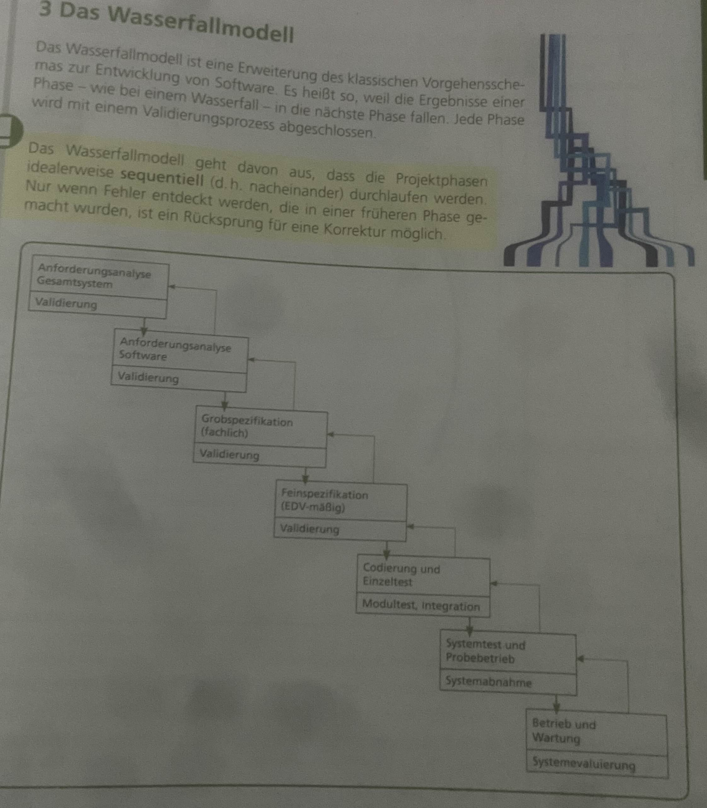
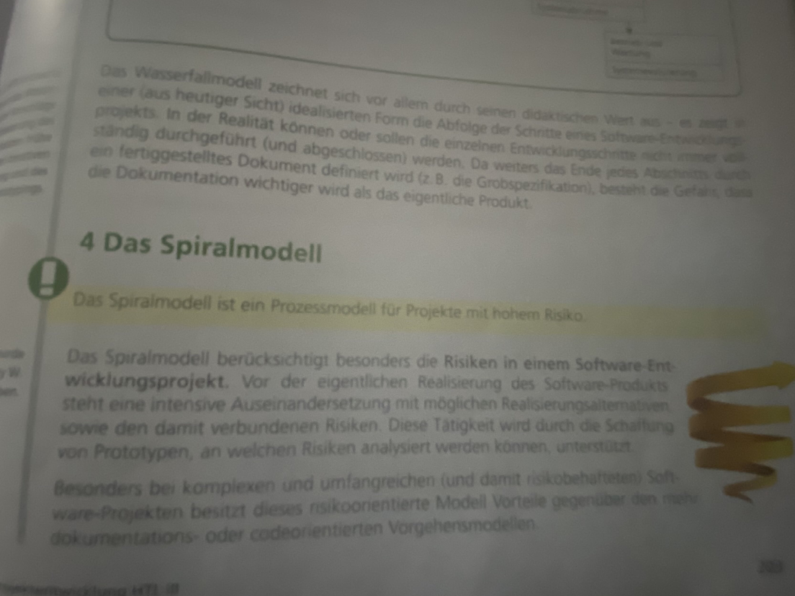
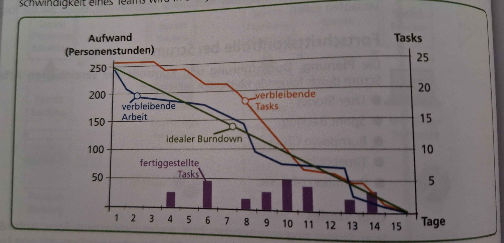
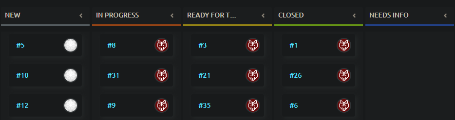

# SYP Wiederholung 4. Klasse

# Traditionelles (Klassisches) Projektmanagement

## Grundzüge
- PL, PO, PTM, PM
- Projekt Organisationsformen:
  - Reine Organisationsform
  - matrix Organisationsform
  - einfluss Organisationsform
- aufgabenplanung wird durch agilem P.M. ersetzt 

## Vorgehensmodelle

  
Prozessmodelle gliedern Software-Entwicklungsprojekte in zeitliche Phasen und spezifische Vorgänge, um den komplexen Ablauf planbar zu machen und eine konstante Qualität sicherzustellen. Verschiedene Modelle haben sich entwickelt, die sich in Anzahl und Abfolge der Phasen sowie in den Methoden unterscheiden.

   <b>Genau:</b> 
Prozessmodelle untergliedern das Software-Entwicklungsprojekt in zeitliche Abschnitte (Phasen) und in bestimmte Vorgänge (Pro-zesse), die im Zeitverlauf zu absolvieren sind. Ziel der Prozessmo-delle ist es, den komplexen Ablauf der Software-Entwicklung planbar zu machen und eine konstant hohe Qualität des Entwicklungsprozesses zu gewährleisten.
Im Laufe der Zeit haben sich unterschiedliche Modelle mit verschiedenen Schwerpunkten herausgebildet. Sie unterscheiden sich in der Anzahl und Abfolge der Phasen sowie in den einzusetzenden Methoden

### Wasserfallmodell

### Spiralmodell

## 3. Methoden und Instrumente für Klassisches PM (situative Auswahl!) TODO
- Projektstart (Auftrag, Kick-off)
- Zieldefinition (Muss-/Kannziele, Haupt-/Vorgangs-/Nichtziele, SMART)
- Projektorganisation (Rollen, Formen, P-Organigramm)
- Projektkontext (sachlich ,zeitlich, sozial) und Umweltanalyse
- Aufgabenplanung (PSP, Arbeitspakete, Funktionendiagramm)
- Zeitplanung (Meilensteine, Terminliste, Balkendiagramm, Netzplan)
- Ressourcen- und Kostenplanung
- Projektcontrolling u. Abweichungsteuerung (P-Status/Score Card)
- Projektrisiken und Krisenbewältigung
- Projektmarketing
- Projektabschluss (Übergabe, Abnahme)

## Stärken
- Geringe Unsicherheit (kann schwer was schiefgehen durch das ständige Überprüfen)
- Qualitätskontrolle (Meilensteine)

## Schwächen
- Hoher Planungsaufwand
- Kein Prototyp nach kurzer Zeit

 

# Agiles Projektmanagement
## Grundzüge Agiles PM (Werte, Prinzipen)
- **Kundenzufriedenheit**
- **Anforderungsänderungen**
- **Funktionsfähige Software**
- **Zusammenarbeit** von Entwicklern
- **Motivierte Teammitglieder**
- Entwicklungsteams halten **persönliche Gespräche**
- Projektfortschritt mit **funktionierender Software** gemessen
- "Agile Methoden" ermöglichen einen **konstanten** und **nachhaltigen Entwicklungsprozess**
- Überwachen auf **technische Kompetenz** und **gutes Design**
- Die **einfachste Lösung** finden
- Die besten Lösungen entstehen in **selbstorganisierten Teams**
- **Regelmäßige Reflexion im Team** verbessert das Projekt

## Vorgehen
- **Scrum** ist ein Rahmen, mit dem Projekte **agil**, also flexibel und ohne viel Bürokratie, umgesetzt werden können. 
  So können Teams schnell auf Änderungen reagieren und effizient arbeiten, egal um welches Projekt es geht.

## Scrum
### Rollen
- **Product Owner**: Vertritt den Auftraggeber
- **Scrum Master**: Modieriert den Entwicklungsprozess nach der Scrum-Methode; Unterstützt *Product Owner* und *Team*
- **Team**: Entwickler des Projekts

### Aktivitäten
- **Sprints**: Projekt wird mit kleinen Sprints durchgeführt, die ca. 2 Wochen dauern
- **Sprints planen**: undefined

## Product Backlog
- Bildet **Sammlung aller Anforderungen**.
- **Vision**: **Product Owner** und Kunde bestimmen den Nutzen eds zu erstellenden Programm.
- Auf die **Visionen** aufbauend, beschreibt der Product Owner mit hilfe von **User Stories** die Funktioen die das Programm erfüllen soll.

## User Stories
- **Kunden-/Anwenderorientierte** Form, **Aufforderungen** zu beschreiben.
- Hilft bei der Kommunikation mit dem Kunden.
- Macht Projektfortschritt für Kunden sichtbar.
- Wird vom Product Owner formuliert.

## Story Points
- Maßeinheit zum festellen von **Aufwand**, **Größe** und **Komplexität** für eine User Story.
- Wird statt Stunden/Tagen gemessen.

## Velocity
- Misst die Anzahl von **Story Points** die in einem **Sprint** in einem festgelegtem Zeitraum.
- Hilft Teams, ihre Leistung zu verfolgen um zukünftige **Sprints** besser planen zu können.
- Wird berechnet, indem man alle **Story Points** von den abgeschlossenen

## Sprint Backlog, Sprint Planning (Priorisierung, Tasks)
- Art Tabelle, wo alle User Stories gelistet werden.
- es kann spalten geben wie z.B: **offen**, **in Arbeit**, **fertig**
- User Stories werden in eigene **Tasks** unterteilt (von *Product Owner* mit den *Team*)

### Wird Priorisiert auf:
- Geschäftswert
- Dringlichkeit
- Abhängigkeiten

## Burndown Chart
- Das Burndown Chart ist eine Grafik, die die Menge der **noch abzuarbeitenden Tasks** angibt.
- Es zeigt an, ob man im **Zeitplan** ist.
- Die **Entwicklungsgeschwindigkeit** wird in Scrum als ***Velocity*** bezeichnet.
- Die **Geschwindigkeit des Teams** wird in ***Story-Points*** angegeben.

## Product Increment
- In jedem Sprint erstellt das Development Team ein Produkt Inkrement. 
- Dies ist letztendlich ein kleiner Teil des “finalen” Produktes. Jedes Produkt Inkrement sollte potentiell auslieferbar sein. 
- Dies bedeutet, dass es nicht ausgeliefert werden muss, aber in einem auslieferbaren Zustand sein soll. Ob ausgeliefert wird entscheidet der Product Owner.

## Taskboard
- **Visualisierung** von Tasks und deren aktuellen Fortschritt

## Releaseplan
- Features die im Sprint entwickelt werden sollen
- Der Plan enthält **Verantwortlichkeiten**, **Ressourcen**, **Aktivitäten** und deren **Prioritäten**.
- Zeigt das Datum des **Releases** an

## Daily Scrum
- **Stand-up** Meeting (max 15 min)
- **Einfache Maßnahmen** werden beschlossen
- Der aktuelle **Projektfortschritt** wird bewertet
### Jeder Teilnehmer beantwortet:
- **Fortschritte** seit letzten mal
- Was mache ich **bis zum nächsten** Daily Scrum
- Gibt es **Probleme**?

##  Sprint Review
- Am Sprint Review nehmen Product Owner, Team, Scrum Master, Vertreter des Kunden, Manager des eigenen Unternehmens, 
- Mitglieder anderer Teams etc. teil. In dieser öffentlichen Form wird die im (bzw. bis zum) 
- letzten Sprint fertiggestellte Software live präsentiert, erklärt und diskutiert. 
- Ziel des Sprint Review ist es, festzustellen, ob die **Erwartungen des Kunden erfüllt** wurden
- oder ob eine Anpassung für den kommenden Sprint erfolgen sollte.

## Sprint Retrospektive
- Zentrales Thema der **Sprint Retrospektive** ist der **Arbeitsprozess** selbst. 
- In einer vom **Scrum Master** moderierten Sitzung werden sowohl **positive** als auch **negative Aspekte** der **Arbeit im vergangenen Sprint** herausgearbeitet und analysiert. 
- **Ziel** ist die **kontinuierliche Verbesserung** des **Scrum-Prozesses** und der **Zusammenarbeit im Team**. 
- Das **Ergebnis** der **Sprint Retrospektive** sind konkret und umsetzbar formulierte **Maßnahmen**, 
- durch die die **folgenden Sprints besser verlaufen** sollen.